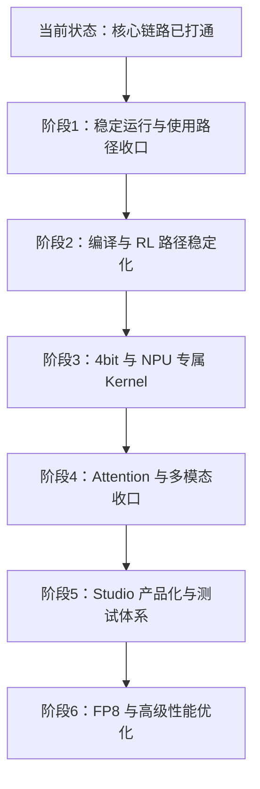
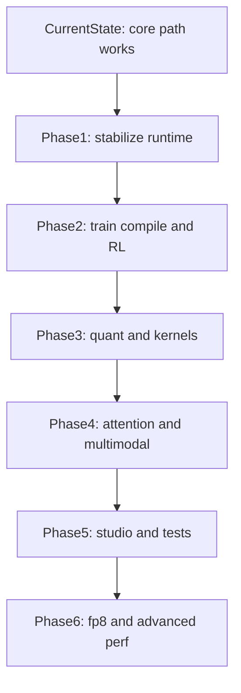

# Ascend NPU 版 Unsloth 路线图

## 文档定位
这份文档用于整理当前分支中 Ascend NPU 适配与优化工作的工程路线图，重点回答三件事：

- 哪些能力已经在代码里落地
- 哪些链路已经能跑但还没有收口
- 后续应该按什么优先级继续推进

这是一份面向工程实现和团队同步的内部文档，不代表已经形成正式对外支持声明。

## 当前判断
相对 `main`，当前分支对 Ascend NPU 的状态更准确的描述是：

- 核心运行时和主训练链路已经打通
- 编译优化、量化优化、Studio 产品化和测试覆盖还没有完全收口
- 当前状态已经超过概念验证，但还没有达到“完全产品化、默认可推广”的阶段

关键证据文件：

- [`unsloth/device_type.py`](unsloth/device_type.py)
- [`unsloth/__init__.py`](unsloth/__init__.py)
- [`unsloth/models/_utils.py`](unsloth/models/_utils.py)
- [`unsloth/kernels/utils.py`](unsloth/kernels/utils.py)
- [`unsloth/models/llama.py`](unsloth/models/llama.py)
- [`unsloth/models/vision.py`](unsloth/models/vision.py)
- [`unsloth/models/loader_utils.py`](unsloth/models/loader_utils.py)
- [`unsloth/models/rl.py`](unsloth/models/rl.py)
- [`unsloth/models/rl_replacements.py`](unsloth/models/rl_replacements.py)
- [`unsloth/utils/attention_dispatch.py`](unsloth/utils/attention_dispatch.py)
- [`studio/backend/utils/hardware/hardware.py`](studio/backend/utils/hardware/hardware.py)
- [`studio/backend/tests/test_gpu_selection.py`](studio/backend/tests/test_gpu_selection.py)
- [`examples/torch-test.py`](examples/torch-test.py)
- [`examples/trl-grpo.py`](examples/trl-grpo.py)
- [`examples/unsloth-grpo.py`](examples/unsloth-grpo.py)
- [`examples/unsloth-grpo-8bit.py`](examples/unsloth-grpo-8bit.py)

## 路线图总览

## 状态概览

| 模块 | 当前状态 | 主要证据 |
| --- | --- | --- |
| 设备识别、BF16、AMP 入口 | 已完成 | [`unsloth/device_type.py`](unsloth/device_type.py), [`unsloth/__init__.py`](unsloth/__init__.py), [`unsloth/models/_utils.py`](unsloth/models/_utils.py) |
| 模型加载、缓存、设备切换 | 已完成 | [`unsloth/models/llama.py`](unsloth/models/llama.py), [`unsloth/models/vision.py`](unsloth/models/vision.py), [`unsloth/models/loader_utils.py`](unsloth/models/loader_utils.py) |
| 低层 stream 桥接与安全回退 | 已完成 | [`unsloth/kernels/utils.py`](unsloth/kernels/utils.py), [`unsloth/kernels/moe/grouped_gemm/interface.py`](unsloth/kernels/moe/grouped_gemm/interface.py) |
| 示例脚本与 smoke test | 已完成 | [`examples/torch-test.py`](examples/torch-test.py), [`examples/unsloth-grpo.py`](examples/unsloth-grpo.py), [`examples/trl-grpo.py`](examples/trl-grpo.py) |
| NPU 编译路径 | 进行中 | [`examples/unsloth-grpo.py`](examples/unsloth-grpo.py), [`examples/unsloth-grpo-8bit.py`](examples/unsloth-grpo-8bit.py), [`unsloth/models/rl.py`](unsloth/models/rl.py) |
| RL / GRPO 清理与优化 | 进行中 | [`unsloth/models/rl_replacements.py`](unsloth/models/rl_replacements.py) |
| Attention 后端统一 | 进行中 | [`examples/unsloth-grpo.py`](examples/unsloth-grpo.py), [`examples/unsloth-grpo-8bit.py`](examples/unsloth-grpo-8bit.py), [`unsloth/utils/attention_dispatch.py`](unsloth/utils/attention_dispatch.py) |
| 4bit 与 NPU 快路径 Kernel | 未完成 | [`unsloth/kernels/utils.py`](unsloth/kernels/utils.py), [`examples/unsloth-grpo.py`](examples/unsloth-grpo.py), [`examples/unsloth-grpo-8bit.py`](examples/unsloth-grpo-8bit.py) |
| Studio 产品化与 NPU 测试 | 未完成 | [`studio/backend/utils/hardware/hardware.py`](studio/backend/utils/hardware/hardware.py), [`studio/backend/tests/test_gpu_selection.py`](studio/backend/tests/test_gpu_selection.py) |
| FP8 与高级性能特性 | 中期目标 | [`unsloth/models/_utils.py`](unsloth/models/_utils.py) |

## 已完成

### 1. 设备识别与基础运行时接入
Ascend NPU 已经进入核心设备抽象层：

- [`unsloth/device_type.py`](unsloth/device_type.py)
  - `get_device_type()` 已识别 `torch.npu.is_available()` 并返回 `"npu"`
  - `get_device_count()` 已接入 `torch.npu.device_count()`
- [`unsloth/__init__.py`](unsloth/__init__.py)
  - BF16 支持能力已通过 `torch.npu.is_bf16_supported()` 接入
- [`unsloth/models/_utils.py`](unsloth/models/_utils.py)
  - NPU AMP 已接入 `torch.npu.amp.custom_fwd` 和 `custom_bwd`
  - NPU 已纳入设备统计与 `is_big_gpu()` 判断逻辑

这说明项目已经把 Ascend 作为可识别的后端来处理，而不是只停留在注释或占位分支。

### 2. 模型主路径、缓存与设备切换支持
主模型路径已经具备 NPU 分支：

- [`unsloth/models/llama.py`](unsloth/models/llama.py)
  - 已接入 `torch.npu.empty_cache`
  - 已接入 `torch.npu.current_device`
  - 已使用 `torch.npu.get_device_properties()` 与 `torch.version.cann` 展示 Ascend 设备信息
- [`unsloth/models/vision.py`](unsloth/models/vision.py)
  - 已接入 NPU 设备统计与缓存清理逻辑
- [`unsloth/models/loader_utils.py`](unsloth/models/loader_utils.py)
  - 分布式设备设置已支持 `torch.npu.set_device(local_rank)`

这也是为什么当前分支更适合定义为“核心 bring-up 已完成，优化仍在继续”，而不是“Ascend 支持尚未开始”。

### 3. 低层 stream 桥接与安全回退策略
运行时已经接到了 NPU 的底层 stream 原语：

- [`unsloth/kernels/utils.py`](unsloth/kernels/utils.py)
  - 已使用 `torch_npu._C._npu_getCurrentRawStream`
  - 已维护 NPU stream 表并通过 `torch.npu.current_stream` 取流
  - 已让 NPU 进入 bitsandbytes dequant / gemv 的通用回退路径，而不是误用 CUDA 专属快路径
- [`unsloth/kernels/moe/grouped_gemm/interface.py`](unsloth/kernels/moe/grouped_gemm/interface.py)
  - 已明确在 NPU 上禁用 TMA 路径，避免落入 Hopper / CUDA 专属优化

当前策略明显是“先保证正确性和稳定性，再逐步补性能快路径”。

### 4. 已有可运行的 Ascend 示例脚本
仓库里已经存在可直接参考的 NPU bring-up 示例：

- [`examples/torch-test.py`](examples/torch-test.py)
  - 最小化 `torch_npu` BF16 matmul 验证
- [`examples/trl-grpo.py`](examples/trl-grpo.py)
  - 直接在 NPU 上跑 `trl` 风格的 GRPO 训练示例
- [`examples/unsloth-grpo.py`](examples/unsloth-grpo.py)
  - Unsloth + LoRA + GRPO 的 Ascend 训练示例
- [`examples/unsloth-grpo-8bit.py`](examples/unsloth-grpo-8bit.py)
  - 基于 torchair 的 NPU `torch.compile` 实验示例

这说明当前分支已经具备“能跑起来”的参考路径，而不只是零散补丁。

### 5. Studio 已具备基础 NPU 硬件感知
Studio 后端已经能够识别并读取 Ascend 设备：

- [`studio/backend/utils/hardware/hardware.py`](studio/backend/utils/hardware/hardware.py)
  - 已定义 `DeviceType.NPU`
  - 已支持 NPU 设备检测
  - 已支持通过 `torch.npu` 获取显存与可见设备数

但这仍然只是基础硬件感知层，离完整的 Ascend Studio 使用体验还有距离。

## 已打通但尚未收口

### 1. 编译优化仍处于探索阶段
当前 NPU 编译路径实际上有两条并存方案：

- 保守方案：
  - [`examples/unsloth-grpo.py`](examples/unsloth-grpo.py) 直接通过 `TORCH_COMPILE_DISABLE=1` 和 `UNSLOTH_COMPILE_DISABLE=1` 关闭编译路径
- 实验方案：
  - [`examples/unsloth-grpo-8bit.py`](examples/unsloth-grpo-8bit.py) 注入 torchair NPU backend，并强制 `fullgraph=False`

补充证据：

- [`unsloth/models/rl.py`](unsloth/models/rl.py) 仍明确留有 NPU compile 选项相关 TODO
- 配套的 `unsloth-zoo` 本地逻辑中，NPU 下的 GRPO 路径仍会在兼容性不足时跳过 `torch.compile`

判断：
编译支持已经开始验证，但还不是默认稳定路径。

### 2. RL / GRPO 已可运行，但仍残留 CUDA 假设
RL 路径整体已经能支撑示例运行，但还没有清理到完全后端无关：

- [`unsloth/models/rl_replacements.py`](unsloth/models/rl_replacements.py)
  - 仍存在 `torch.amp.autocast(device_type = "cuda", ...)` 的逻辑
  - 同一位置旁边已经有 `Unsloth-NPU-FIXME`

判断：
GRPO 已进入“可用但有边角问题”的阶段，而不是“专门为 Ascend 收口过”的阶段。

### 3. Attention 后端策略尚未统一
示例脚本已经表明当前推荐的 attention 后端并不统一：

- [`examples/unsloth-grpo.py`](examples/unsloth-grpo.py)
  - 使用 `attn_implementation="eager"`
- [`examples/unsloth-grpo-8bit.py`](examples/unsloth-grpo-8bit.py)
  - 使用 `attn_implementation="sdpa"`
- [`unsloth/utils/attention_dispatch.py`](unsloth/utils/attention_dispatch.py)
  - 整体仍然是围绕 FlashAttention、xFormers、SDPA 的 GPU 优先分发逻辑

判断：
Ascend 现在更像是“根据场景选择最安全的 attention 后端”，而不是已经有统一的默认策略。

### 4. 4bit 与 NPU 专属快路径仍缺失
这是当前最清晰、最成体系的未完成部分之一：

- [`unsloth/kernels/utils.py`](unsloth/kernels/utils.py)
  - 明确保留了 NPU `fast_dequantize` TODO
  - 明确保留了 NPU `fast_gemv` TODO
  - 当前仍然主要回退到通用 `cgemm_4bit_inference_naive_*` 路径
- [`examples/unsloth-grpo.py`](examples/unsloth-grpo.py)
  - 明确设置了 `load_in_4bit=False`
- [`examples/unsloth-grpo-8bit.py`](examples/unsloth-grpo-8bit.py)
  - 同样没有真正开放 4bit 路径

判断：
Ascend 支持已经超出纯 BF16 bring-up，但 4bit / QLoRA / 量化快路径仍然是下一阶段的重要里程碑。

### 5. Studio 已能识别 Ascend，但工作流仍偏 CUDA 视角
Studio 的硬件感知领先于工作流产品化：

- [`studio/backend/utils/hardware/hardware.py`](studio/backend/utils/hardware/hardware.py)
  - 已能检测和展示 NPU
  - 但不少设备选择逻辑仍以 CUDA 为中心
- [`studio/backend/tests/test_gpu_selection.py`](studio/backend/tests/test_gpu_selection.py)
  - 已有 `TestXpuRejection`
  - 末尾仍然保留了是否增加 `TestNpuRejection` 的 TODO

判断：
Studio 已经能“看到” Ascend，但还没有把 Ascend 完整当成一等工作流目标。

## 后续阶段路线图

### 阶段 1：稳定运行与使用路径收口
目标：把当前依赖示例脚本规避问题的使用方式，沉淀为库内逻辑与文档规范。

优先事项：

- 清理 NPU 运行路径中残留的明显 CUDA-only 假设，尤其是 [`unsloth/models/rl_replacements.py`](unsloth/models/rl_replacements.py)
- 增加专门的 Ascend bring-up 文档，而不是要求使用者反向阅读 examples
- 梳理 `torch`、`torch_npu`、CANN、`unsloth_zoo` 的兼容矩阵
- 把当前 example 级别的 compile、attention backend、dtype 推荐方式沉淀为明确规则

完成标准：

- 用户不完全依赖 example 也能把 Unsloth 在 Ascend 上跑起来
- 主训练链路不再残留显而易见的 CUDA-only 假设

### 阶段 2：编译与 RL 路径稳定化
目标：让 NPU compile 路径从“实验可选”变成“稳定可复用”。

优先事项：

- 重新收口 [`unsloth/models/_utils.py`](unsloth/models/_utils.py) 中的 NPU compile 选项
- 重新收口 [`unsloth/models/rl.py`](unsloth/models/rl.py) 中的 RL compile 注入逻辑
- 降低 GRPO 在 NPU 下必须整体跳过 compile 的情况
- 明确默认策略：
  - 为稳定性默认关闭 compile
  - 或对已验证路径默认启用 torchair-backed compile

完成标准：

- 至少一条 LoRA 或 GRPO 训练链路能在 Ascend 上稳定使用 compile
- 主要集成方式不再依赖 example 中的 monkey patch

### 阶段 3：4bit 与 NPU 专属 Kernel
目标：把当前的通用回退路径升级为真正针对 Ascend 的快路径。

优先事项：

- 增加或接入 NPU 专属 `fast_dequantize`
- 增加或接入 NPU 专属 `fast_gemv`
- 重新评估通用 `cgemm_4bit_inference_naive_*` 在 Ascend 上的正确性与性能
- 用至少一条已验证的 QLoRA / 4bit 路径替换示例中反复出现的 `load_in_4bit=False`

完成标准：

- 至少一条 4bit 推理或 QLoRA 训练链路在 Ascend 上可验证
- 性能不再完全受制于通用 fallback kernel

### 阶段 4：Attention 与多模态链路收口
目标：统一 Ascend 上的 attention 策略，并补齐 vision 相关边角。

优先事项：

- 为 [`unsloth/utils/attention_dispatch.py`](unsloth/utils/attention_dispatch.py) 定义明确的 NPU backend 策略
- 收口 [`unsloth/models/vision.py`](unsloth/models/vision.py) 中 NPU + cache + vLLM 假设 + quantization 的 TODO
- 明确何时使用 `eager`，何时使用 `sdpa`，以及未来 fused attention 的前置条件

完成标准：

- 文本模型与 vision 模型都具备清晰的 Ascend 推荐配置
- 用户不再需要从不同 examples 中猜默认 attention 策略

### 阶段 5：Studio 产品化与测试体系
目标：让 Ascend 在 Studio 中从“可以识别”升级为“行为可预测、体验可维护”。

优先事项：

- 强化 [`studio/backend/utils/hardware/hardware.py`](studio/backend/utils/hardware/hardware.py) 中的 Ascend 专属逻辑
- 在 [`studio/backend/tests/test_gpu_selection.py`](studio/backend/tests/test_gpu_selection.py) 中增加 NPU 设备选择与拒绝测试
- 重新评估当前类似 “only supported on CUDA” 的提示语是否需要为 NPU 提供独立说明
- 增加 NPU smoke test 与训练 / 保存导出的最小回归测试

完成标准：

- Studio 在 Ascend 场景下的设备检测、报错与监控行为可预测
- NPU 回归问题能够先被测试发现，而不是先被用户通过示例脚本撞出来

### 阶段 6：FP8 与高级性能优化
目标：在基础能力稳定后，再进入高阶性能和高阶特性的适配阶段。

候选方向：

- [`unsloth/models/_utils.py`](unsloth/models/_utils.py) 中已经提到的 Ascend 950+ FP8 支持
- 更深层的 compile、fused kernel 和长上下文优化
- 更完整的 RL、多模态、长上下文性能优化

判断：
这是中期目标，不适合作为当前分支的第一优先级。

## 推荐推进顺序
建议下一轮工程执行顺序如下：

1. 阶段 1：稳定运行与使用路径收口
2. 阶段 2：编译与 RL 路径稳定化
3. 阶段 3：4bit 与 NPU 专属 Kernel
4. 阶段 5：Studio 产品化与测试体系
5. 阶段 4：Attention 与多模态链路收口
6. 阶段 6：FP8 与高级性能优化

如果当前只能选一个最优先的下一阶段，建议选择：

- 阶段 1：稳定运行与使用路径收口

原因：

- 它能把当前分支从“熟悉代码的人可以跑通”提升到“其他人可以稳定复现”
- 它也能降低后续优化工作的支持成本，因为基线行为会先被定义清楚

## 对团队的推荐表述
如果要用于内部同步、周报或管理沟通，当前最准确的描述是：

- Ascend NPU 的设备识别、BF16 / AMP 入口、主模型运行分支和 Studio 基础硬件感知已经实现
- 基于 example 的 GRPO 与 smoke test 路径已经能在 Ascend 上跑起来
- 当前重点正在转向 compile 稳定性、RL 清理、attention 策略、4bit 支持、NPU 专属 kernel、Studio 产品化与测试覆盖

## 风险与约束

- [`README.md`](README.md) 和 [`pyproject.toml`](pyproject.toml) 仍然没有把 Ascend 作为正式文档化支持目标来对外声明
- 当前 examples 仍然依赖 `load_in_4bit=False`、`attn_implementation="eager"` 或 `"sdpa"`、以及 compile disable 等稳定性规避手段
- NPU 自动化回归覆盖仍然偏薄
- 一部分相关逻辑目前依赖本地配套的 `unsloth-zoo` checkout，而不是完全沉淀在当前仓库正式受控的主树里
# Ascend NPU Unsloth Roadmap

## Scope
This document is an internal engineering roadmap for the current Ascend NPU bring-up work in this branch and workspace.
It reflects what is already wired into the codebase, what is partially implemented but not yet stable, and what should be prioritized next.
It is not an official public support statement.

## Current Assessment
Relative to `main`, the current branch is best described as:

- Core Ascend NPU runtime and training paths are already wired in.
- Performance optimization, quantization, compile stability, Studio UX, and test coverage are not yet fully closed.
- The work is beyond a proof of concept, but it is not yet at a "fully productized" stage.

Key evidence files:

- [`unsloth/device_type.py`](unsloth/device_type.py)
- [`unsloth/__init__.py`](unsloth/__init__.py)
- [`unsloth/models/_utils.py`](unsloth/models/_utils.py)
- [`unsloth/kernels/utils.py`](unsloth/kernels/utils.py)
- [`unsloth/models/llama.py`](unsloth/models/llama.py)
- [`unsloth/models/vision.py`](unsloth/models/vision.py)
- [`unsloth/models/rl.py`](unsloth/models/rl.py)
- [`unsloth/models/rl_replacements.py`](unsloth/models/rl_replacements.py)
- [`unsloth/utils/attention_dispatch.py`](unsloth/utils/attention_dispatch.py)
- [`studio/backend/utils/hardware/hardware.py`](studio/backend/utils/hardware/hardware.py)
- [`studio/backend/tests/test_gpu_selection.py`](studio/backend/tests/test_gpu_selection.py)
- [`examples/torch-test.py`](examples/torch-test.py)
- [`examples/trl-grpo.py`](examples/trl-grpo.py)
- [`examples/unsloth-grpo.py`](examples/unsloth-grpo.py)
- [`examples/unsloth-grpo-8bit.py`](examples/unsloth-grpo-8bit.py)

## Roadmap Overview

## Status Summary

| Area | Status | Evidence |
| --- | --- | --- |
| Device detection and BF16/AMP entry points | Done | [`unsloth/device_type.py`](unsloth/device_type.py), [`unsloth/__init__.py`](unsloth/__init__.py), [`unsloth/models/_utils.py`](unsloth/models/_utils.py) |
| Model loading, cache, device switching | Done | [`unsloth/models/llama.py`](unsloth/models/llama.py), [`unsloth/models/vision.py`](unsloth/models/vision.py), [`unsloth/models/loader_utils.py`](unsloth/models/loader_utils.py) |
| Low-level stream bridge and safe fallbacks | Done | [`unsloth/kernels/utils.py`](unsloth/kernels/utils.py), [`unsloth/kernels/moe/grouped_gemm/interface.py`](unsloth/kernels/moe/grouped_gemm/interface.py) |
| Example-based smoke tests | Done | [`examples/torch-test.py`](examples/torch-test.py), [`examples/unsloth-grpo.py`](examples/unsloth-grpo.py), [`examples/trl-grpo.py`](examples/trl-grpo.py) |
| Compile path for NPU | In progress | [`examples/unsloth-grpo.py`](examples/unsloth-grpo.py), [`examples/unsloth-grpo-8bit.py`](examples/unsloth-grpo-8bit.py), [`unsloth/models/rl.py`](unsloth/models/rl.py) |
| RL and GRPO cleanup | In progress | [`unsloth/models/rl_replacements.py`](unsloth/models/rl_replacements.py) |
| Attention backend unification | In progress | [`examples/unsloth-grpo.py`](examples/unsloth-grpo.py), [`examples/unsloth-grpo-8bit.py`](examples/unsloth-grpo-8bit.py), [`unsloth/utils/attention_dispatch.py`](unsloth/utils/attention_dispatch.py) |
| 4-bit and fast NPU kernels | Not done | [`unsloth/kernels/utils.py`](unsloth/kernels/utils.py), [`examples/unsloth-grpo.py`](examples/unsloth-grpo.py), [`examples/unsloth-grpo-8bit.py`](examples/unsloth-grpo-8bit.py) |
| Studio productization and NPU tests | Not done | [`studio/backend/utils/hardware/hardware.py`](studio/backend/utils/hardware/hardware.py), [`studio/backend/tests/test_gpu_selection.py`](studio/backend/tests/test_gpu_selection.py) |
| FP8 and advanced perf features | Future | [`unsloth/models/_utils.py`](unsloth/models/_utils.py) |

## Completed

### 1. Device detection and base runtime wiring
Ascend NPU is already part of the core device abstraction:

- [`unsloth/device_type.py`](unsloth/device_type.py)
  - `get_device_type()` recognizes `torch.npu.is_available()` and returns `"npu"`.
  - `get_device_count()` uses `torch.npu.device_count()`.
- [`unsloth/__init__.py`](unsloth/__init__.py)
  - BF16 support detection is wired through `torch.npu.is_bf16_supported()`.
- [`unsloth/models/_utils.py`](unsloth/models/_utils.py)
  - NPU AMP hooks use `torch.npu.amp.custom_fwd` and `custom_bwd`.
  - NPU is already included in device statistics and `is_big_gpu()` related logic.

This means the project already knows how to recognize Ascend as a first-class backend in the runtime entry layer.

### 2. Model path and cache/device handling
The main model paths already contain NPU-specific runtime branches:

- [`unsloth/models/llama.py`](unsloth/models/llama.py)
  - NPU cache cleanup is wired through `torch.npu.empty_cache`.
  - NPU device reporting uses `torch.npu.get_device_properties()` and `torch.version.cann`.
- [`unsloth/models/vision.py`](unsloth/models/vision.py)
  - NPU device stats and cache cleanup branches already exist.
- [`unsloth/models/loader_utils.py`](unsloth/models/loader_utils.py)
  - Distributed device setup already includes `torch.npu.set_device(local_rank)`.

This is the main reason the current branch is better described as "bring-up completed, optimization ongoing" rather than "NPU support has not started."

### 3. Low-level stream bridge and safe fallback behavior
The runtime is already bridged down to NPU stream primitives:

- [`unsloth/kernels/utils.py`](unsloth/kernels/utils.py)
  - Uses `torch_npu._C._npu_getCurrentRawStream`.
  - Maintains NPU stream lookup tables and uses `torch.npu.current_stream`.
  - Routes NPU through generic bitsandbytes dequant/gemv fallback logic instead of CUDA-only fast paths.
- [`unsloth/kernels/moe/grouped_gemm/interface.py`](unsloth/kernels/moe/grouped_gemm/interface.py)
  - Explicitly disables TMA support on NPU to avoid Hopper/CUDA-only optimizations.

This is a deliberate stability-first design: the code avoids pretending Ascend can use CUDA-specific performance paths that it does not support.

### 4. Example scripts and smoke tests already exist
The repository already contains concrete NPU bring-up examples:

- [`examples/torch-test.py`](examples/torch-test.py)
  - Small BF16 matmul smoke test with `torch_npu`.
- [`examples/trl-grpo.py`](examples/trl-grpo.py)
  - GRPO training example directly on NPU with `attn_implementation="eager"`.
- [`examples/unsloth-grpo.py`](examples/unsloth-grpo.py)
  - Unsloth-based GRPO + LoRA training example on Ascend.
- [`examples/unsloth-grpo-8bit.py`](examples/unsloth-grpo-8bit.py)
  - Experimental torchair-based compile setup for NPU.

This confirms that the current branch already has runnable reference flows, not just code stubs.

### 5. Studio already has base NPU hardware awareness
Studio backend code can already detect and inspect Ascend devices:

- [`studio/backend/utils/hardware/hardware.py`](studio/backend/utils/hardware/hardware.py)
  - Defines `DeviceType.NPU`.
  - Detects NPU devices.
  - Queries memory usage and visible device count through `torch.npu`.

However, this is still only the foundation layer, not a complete Ascend Studio experience.

## In Progress or Not Yet Closed

### 1. Compile optimization is still experimental
There are currently two coexisting strategies:

- Conservative path:
  - [`examples/unsloth-grpo.py`](examples/unsloth-grpo.py) disables compile with `TORCH_COMPILE_DISABLE=1` and `UNSLOTH_COMPILE_DISABLE=1`.
- Experimental path:
  - [`examples/unsloth-grpo-8bit.py`](examples/unsloth-grpo-8bit.py) injects a torchair NPU backend and forces `fullgraph=False`.

Supporting evidence:

- [`unsloth/models/rl.py`](unsloth/models/rl.py) still contains a TODO to revisit compile options for NPU.
- Local companion checkout logic in `unsloth-zoo` also skips `torch.compile` on NPU in the GRPO path when compatibility is uncertain.

Assessment:
Compile support has started, but it is not yet the default stable path.

### 2. RL and GRPO work, but still retain CUDA assumptions
The RL path is functional enough to run examples, but not fully cleaned up:

- [`unsloth/models/rl_replacements.py`](unsloth/models/rl_replacements.py)
  - Still contains `torch.amp.autocast(device_type = "cuda", ...)` in a code path that has an adjacent NPU FIXME.

Assessment:
GRPO is already in the "works with caveats" state, not the "fully optimized and backend-clean" state.

### 3. Attention backend policy is not yet unified
Current examples already show that the recommended attention backend is not settled:

- [`examples/unsloth-grpo.py`](examples/unsloth-grpo.py) uses `attn_implementation="eager"`.
- [`examples/unsloth-grpo-8bit.py`](examples/unsloth-grpo-8bit.py) uses `attn_implementation="sdpa"`.
- [`unsloth/utils/attention_dispatch.py`](unsloth/utils/attention_dispatch.py) remains centered around FlashAttention, xFormers, and SDPA GPU-first selection logic.

Assessment:
Ascend currently has a "pick the safest backend for the scenario" policy, but not yet a settled backend strategy with a single default recommendation.

### 4. 4-bit and fast NPU kernels are still missing
This is one of the clearest unfinished areas:

- [`unsloth/kernels/utils.py`](unsloth/kernels/utils.py)
  - Explicit NPU TODOs remain for `fast_dequantize`.
  - Explicit NPU TODOs remain for `fast_gemv`.
  - The code still falls back to generic `cgemm_4bit_inference_naive_*` paths.
- [`examples/unsloth-grpo.py`](examples/unsloth-grpo.py)
  - Forces `load_in_4bit=False`.
- [`examples/unsloth-grpo-8bit.py`](examples/unsloth-grpo-8bit.py)
  - Also forces `load_in_4bit=False`.

Assessment:
Ascend bring-up is already past pure BF16 plumbing, but 4-bit and fast quantized kernels are still a major next milestone.

### 5. Studio is Ascend-aware, but still CUDA-centric in workflow
Studio hardware detection is ahead of Studio workflow support:

- [`studio/backend/utils/hardware/hardware.py`](studio/backend/utils/hardware/hardware.py)
  - Detects and reports NPU.
  - Still treats GPU selection workflows as CUDA-first in several places.
- [`studio/backend/tests/test_gpu_selection.py`](studio/backend/tests/test_gpu_selection.py)
  - Contains `TestXpuRejection`.
  - Ends with a TODO asking whether a `TestNpuRejection` should be added.

Assessment:
Studio can already see Ascend, but device selection, error messaging, and tests are not yet fully aligned with NPU as a first-class workflow target.

## Next Milestones

### Phase 1. Stabilize runtime and user path
Goal: move the current example-based workarounds into the library and documentation layer.

Priority items:

- Remove remaining obvious CUDA-only assumptions in NPU runtime paths, especially in [`unsloth/models/rl_replacements.py`](unsloth/models/rl_replacements.py).
- Add a dedicated Ascend bring-up document and installation notes instead of requiring users to reverse-engineer examples.
- Clarify the expected `torch`, `torch_npu`, CANN, and `unsloth_zoo` compatibility matrix.
- Turn current example-level recommendations for compile, attention backend, and dtype into explicit guidance.

Exit criteria:

- A user can bring up Unsloth on Ascend without relying entirely on the example scripts.
- Primary training flows no longer retain obvious CUDA-only assumptions.

### Phase 2. Stabilize compile and RL optimization
Goal: make NPU compile paths predictable and reusable.

Priority items:

- Revisit NPU-specific compile options in [`unsloth/models/_utils.py`](unsloth/models/_utils.py).
- Revisit RL compile injection in [`unsloth/models/rl.py`](unsloth/models/rl.py).
- Reduce the need to skip compile in NPU RL paths where torchair can safely be used.
- Decide the default strategy:
  - compile off by default for stability, or
  - torchair-backed compile by default for supported flows.

Exit criteria:

- At least one LoRA or GRPO training path can use compile stably on Ascend.
- Example-level monkey patching is no longer the primary integration mechanism.

### Phase 3. Add 4-bit and NPU-specific kernel acceleration
Goal: replace generic fallback behavior with Ascend-oriented performance paths.

Priority items:

- Add or integrate NPU-specific `fast_dequantize`.
- Add or integrate NPU-specific `fast_gemv`.
- Re-evaluate the correctness and performance of generic `cgemm_4bit_inference_naive_*` calls on Ascend.
- Replace repeated `load_in_4bit=False` example constraints with at least one validated QLoRA path.

Exit criteria:

- At least one 4-bit inference or QLoRA flow is validated on Ascend.
- Performance is no longer dominated by generic fallback kernels.

### Phase 4. Unify attention and multimodal guidance
Goal: define the correct attention strategy and close remaining vision-specific gaps.

Priority items:

- Define a documented NPU backend policy for [`unsloth/utils/attention_dispatch.py`](unsloth/utils/attention_dispatch.py).
- Close NPU-specific TODOs in [`unsloth/models/vision.py`](unsloth/models/vision.py), especially around cache, vLLM-related assumptions, and quantization interactions.
- Clearly define when Ascend should use `eager`, when it should use `sdpa`, and what future fused-attention work would require.

Exit criteria:

- Text and vision paths both have a clear recommended Ascend configuration.
- Users no longer need to infer backend choice from disparate example scripts.

### Phase 5. Productize Studio and add regression coverage
Goal: make Ascend a predictable Studio backend rather than just a detectable device.

Priority items:

- Improve Ascend-specific logic in [`studio/backend/utils/hardware/hardware.py`](studio/backend/utils/hardware/hardware.py).
- Add NPU-specific device-selection and rejection tests in [`studio/backend/tests/test_gpu_selection.py`](studio/backend/tests/test_gpu_selection.py).
- Revisit CUDA-only user messaging such as "only supported on CUDA" where NPU needs different guidance.
- Add NPU smoke tests and minimum regression coverage for training and save/export paths.

Exit criteria:

- Studio behavior on Ascend is predictable.
- Regressions in NPU support are caught by tests rather than by manual example runs.

### Phase 6. FP8 and advanced performance features
Goal: move from baseline enablement into advanced Ascend optimization.

Candidate items:

- FP8 support mentioned in [`unsloth/models/_utils.py`](unsloth/models/_utils.py) for higher-end Ascend hardware.
- Deeper compile and fused-kernel optimization work.
- Stronger long-context, RL, and multimodal optimization after the base runtime is stable.

Assessment:
This is a medium-term roadmap item, not the first thing that should be prioritized now.

## Recommended Priority Order
Recommended engineering order for the next cycle:

1. Phase 1: stabilize runtime and user path
2. Phase 2: stabilize compile and RL optimization
3. Phase 3: add 4-bit and NPU-specific kernel acceleration
4. Phase 5: productize Studio and add regression coverage
5. Phase 4: unify attention and multimodal guidance
6. Phase 6: FP8 and advanced performance features

If only one next milestone is selected, the recommended choice is:

- Phase 1: stabilize runtime and user path

Reason:

- It converts the current branch from "engineers can run it with local knowledge" into "others can reproduce it reliably."
- It also reduces the support cost of later optimization work because the baseline behavior becomes explicit.

## Suggested Team Message
For internal sync or management updates, the most accurate wording is:

- Ascend NPU device detection, BF16/AMP entry points, primary model runtime branches, and basic Studio hardware awareness are already implemented.
- Example-based GRPO and smoke-test flows already run on Ascend.
- Current work is focused on compile stability, RL cleanup, attention policy, 4-bit support, NPU-specific kernels, Studio productization, and test coverage.

## Risks and Constraints

- [`README.md`](README.md) and [`pyproject.toml`](pyproject.toml) still do not present Ascend as an official documented support target.
- Current examples still rely on stability workarounds such as `load_in_4bit=False`, `attn_implementation="eager"` or `"sdpa"`, and compile disable flags.
- Automated NPU-specific regression coverage is still thin.
- Some supporting logic currently lives in a local `unsloth-zoo` companion checkout rather than in the tracked tree of this repository.
